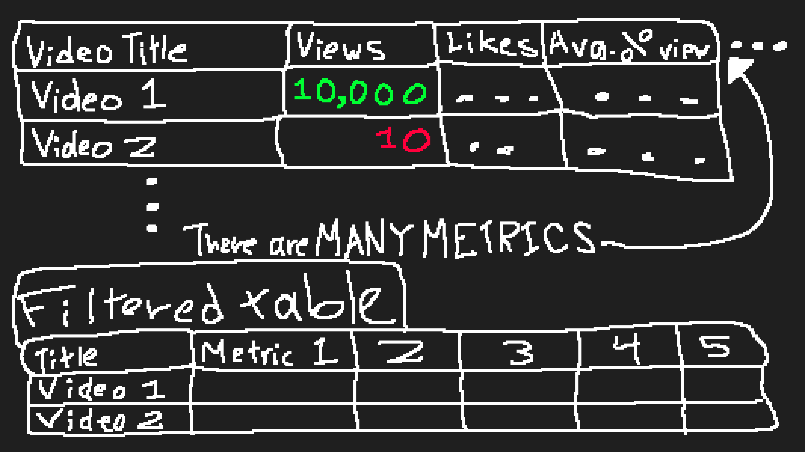
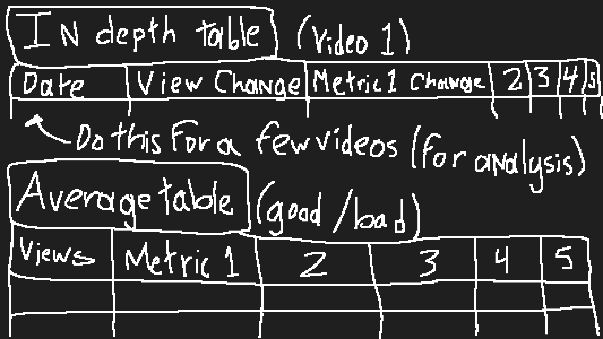
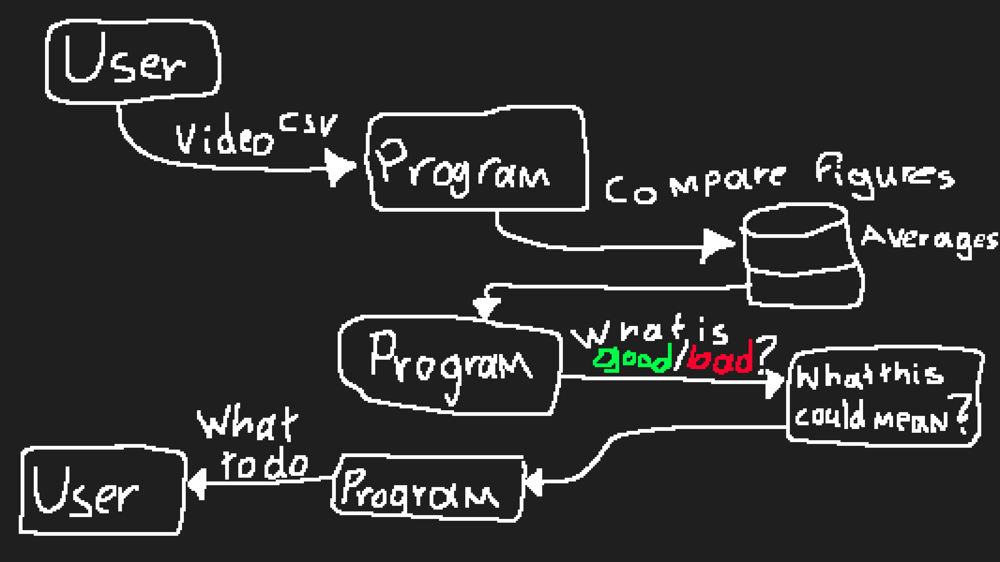

# Project Initial Design
### Summarize in words and pictures what your project purpose and goals are & Make initial goals for where you want your project to be at each day until the end of class

Found in the [Read Me.](../README.md) In short, first I want to analyze the data to find what correlates the most with a successful video, and then using that data I want to make a program that compares the metrics of any video in an effort to point the user towards what they might want to work on. 

### Sketch your initial thinking on your ERD and the data your project will be accessing and using

### Sketch rough system design of your project, what are the technologies and pieces (shapes) and interactions (arrows)

